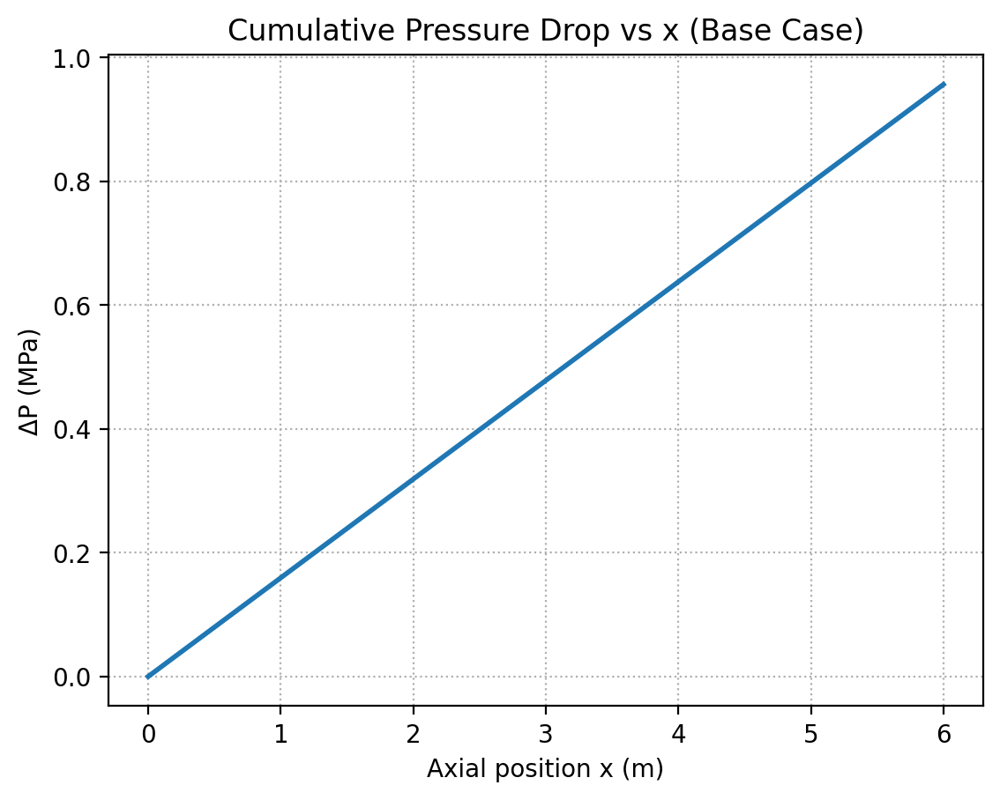
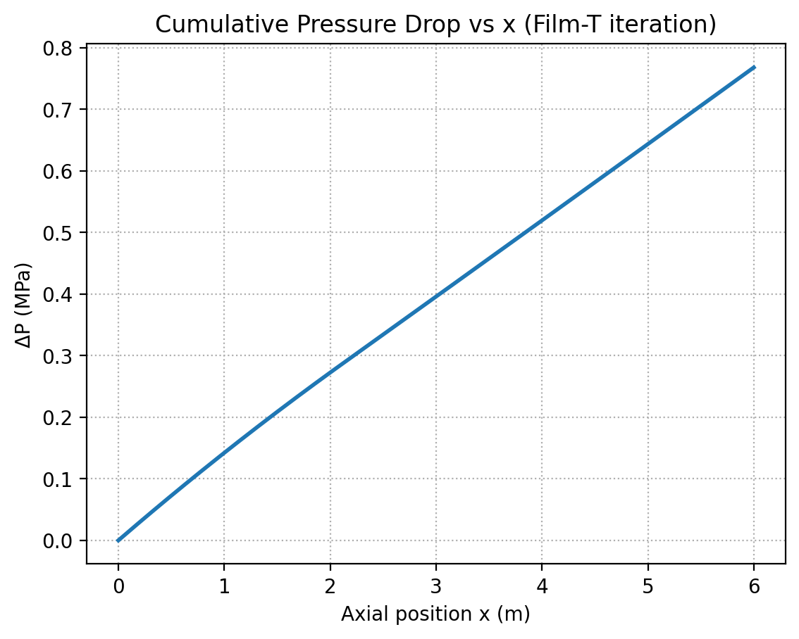
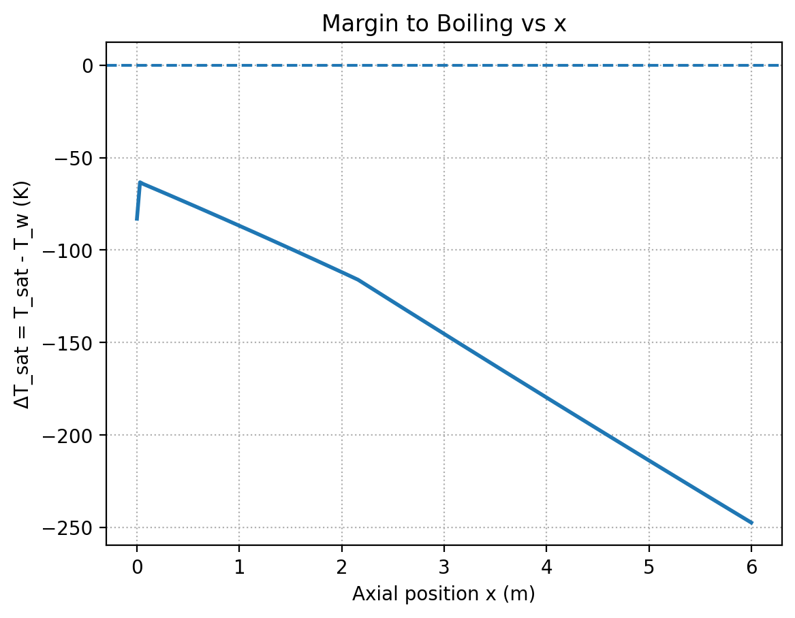
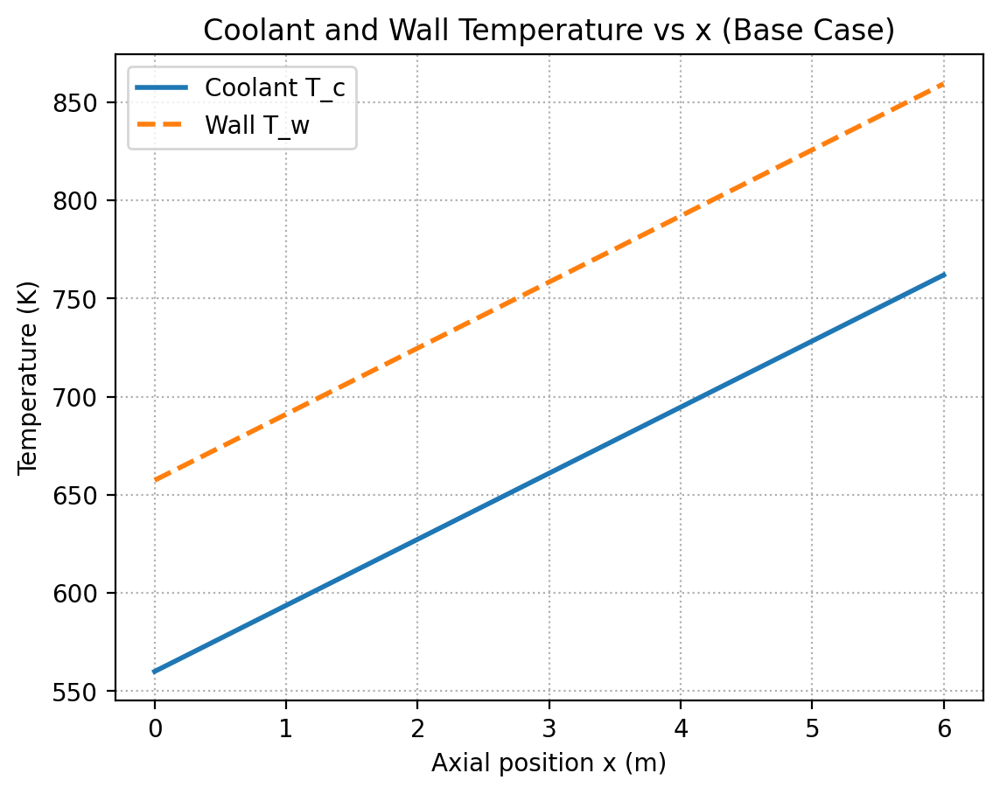
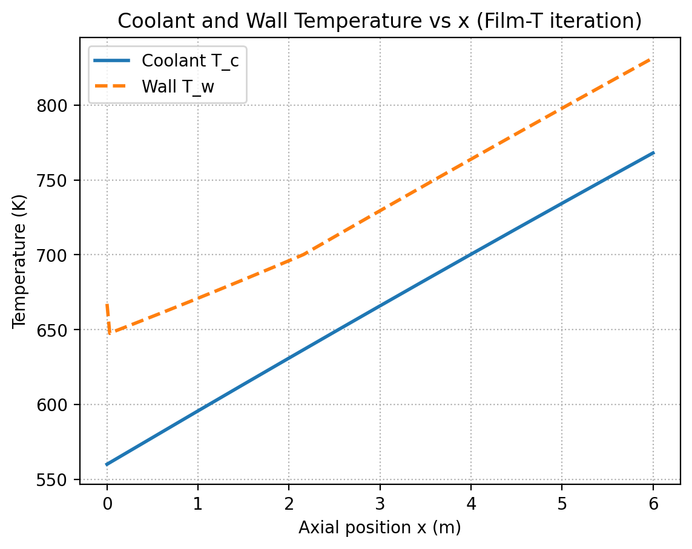
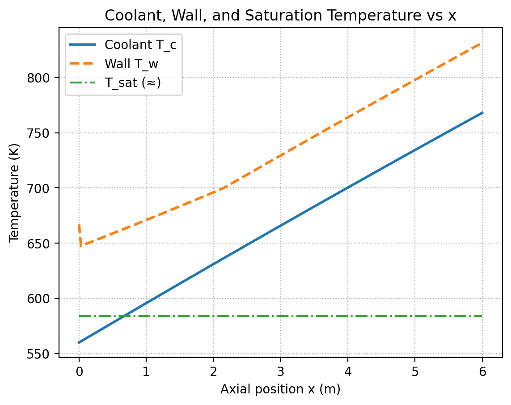
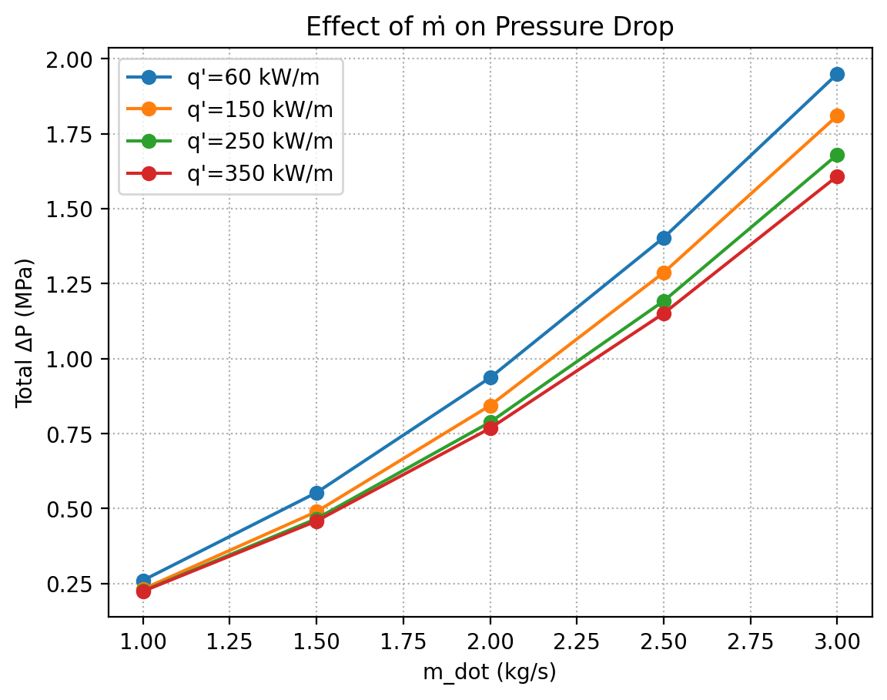
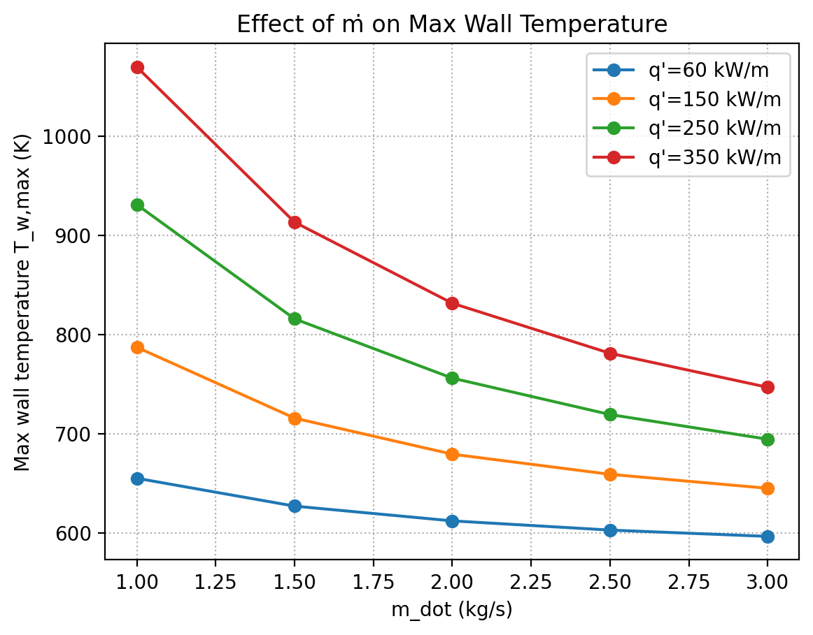

# CANDU Fuel Channel Heat Transfer Model

A simplified, educational thermal–hydraulics model of a **CANDU pressure tube channel**.  
Implements a **1-D axial energy balance** with convective heat transfer, wall temperature estimation, and pressure drop correlations.  

This project is designed to be **portfolio-ready**: clear code structure, reproducible figures, and concise engineering insights.

---

## 📌 Features
- **Coolant heating** along the channel (axial energy balance).
- **Film-temperature property iteration** (ρ, μ, k, cp vary with T).
- **Convective heat transfer** using Dittus–Boelter correlation.
- **Wall temperature** calculation and comparison to coolant.
- **Pressure drop** using Darcy–Weisbach (Blasius, option to extend to Churchill).
- **Margin to boiling**: ΔT_sat = T_sat(P) – T_w.
- **Parametric sweeps**: effect of mass flow rate and heat flux on T_w and ΔP.

---

## 📂 Repo Structure
```text
candu-channel-model/
├── README.md
├── requirements.txt
├── data/                  # CSV outputs
├── figures/               # Auto-generated plots
├── notebooks/             # (optional) Jupyter exploration
├── reports/               # Short report with results
├── src/
│   ├── props/             # Property functions (water/D2O)
│   │   └── props_water.py
│   ├── models/
│   │   └── axial_steady.py
│   ├── plots/
│   │   └── param_sweep.py
│   └── validate/          # Future validation scripts
└── matlab/                # Equivalent MATLAB Live Scripts

```
## ⚙️ Installation
Clone the repo and install dependencies:

git clone https://github.com/mugjeff12/CANDU-Fuel-Channel-Heat-Transfer-Model.git

cd candu-channel-model

pip install -r requirements.txt

## ▶️ Usage

Base steady-state channel run
python src/models/axial_steady.py


Outputs:

CSV → data/axial_steady_base.csv

Figures → figures/Tx_coolant_wall_Tsat.png, figures/dP_x_filmT.png, figures/margin_to_boiling.png

Parametric sweep (ṁ, q′)
python src/plots/param_sweep.py


Outputs:

CSV → data/sweep_mdots_qline.csv

Figures → figures/sweep_Twmax_vs_mdot.png, figures/sweep_dP_vs_mdot.png

## 📊 Example Results

| Case | T_in (K) | ṁ (kg/s) | q′ (kW/m) | T_out (K) | ΔP (MPa) | Margin ΔT_sat |
|------|----------|-----------|-----------|-----------|----------|----------------|
| Base | 560      | 2.0       | 350       | 768       | 0.77     | –247 K (boiling risk) |
| Demo | 560      | 2.0       | 60        | 595       | 0.20     | +20 K |

**Trends:**
- Increasing mass flow → ↓ wall T, ↑ ΔP.  
- Increasing heat flux → ↑ coolant and wall T.  

---

## 📊 Example Plots

### Coolant Temperature Rise


### Pressure Drop
  


### Margin to Boiling


### Wall and Coolant Temperatures
  
  


### Parametric Sweeps
  



## 📖 Assumptions
- Single equivalent subchannel (D_h = 12 mm).
- Constant linear heat flux (uniform along channel).
- Water-like properties at ~10 MPa (not actual D2O).
- No spacer effects, subchannel mixing, or CHF correlations (illustrative only).

---

## 🚧 Limitations & Next Steps
- Replace Blasius friction with **Churchill correlation** for all Re.
- Add **CHF flagging** when ΔT_sat < 0.
- Extend to **small transients** (step in q′ or ṁ).
- Include **D2O property fits** instead of water-like placeholders.

---

## 📜 License
MIT License. Free to use for learning, teaching, and portfolio demonstration.


