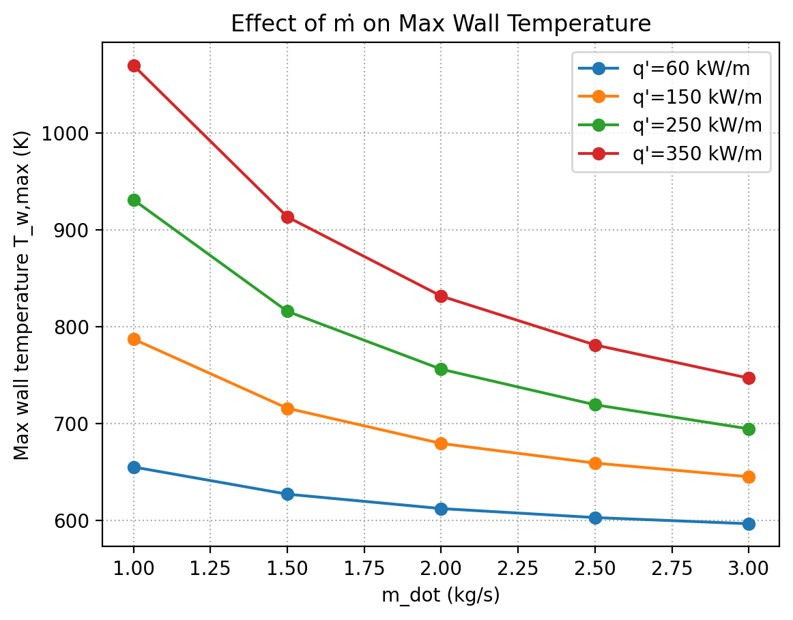

# CANDU Fuel Channel – Short Report

**Author:** _Your Name_  
**Project:** Simplified 1-D CANDU Fuel Channel Heat Transfer Model  
**Repo:** `candu-channel-model`

---

## 1. Purpose & Scope
This report documents a lightweight, educational thermal–hydraulics model of a **CANDU pressure-tube fuel channel**. The goal is to compute:
- Coolant temperature rise \(T_c(x)\)
- Wall temperature \(T_w(x)\) and **margin to boiling** \(\Delta T_{\text{sat}} = T_{\text{sat}} - T_w\)
- Cumulative pressure drop \(\Delta P(x)\)

The model uses a **single equivalent subchannel** (hydraulic diameter \(D_h\)) and classical correlations for heat transfer (Dittus–Boelter) and friction (Churchill). It’s suitable for teaching and portfolio demonstration; it is **not** a design/assessment code.

---

## 2. Assumptions (First-Pass)
- SI units; steady state (transient extension optional).
- Equivalent circular subchannel: \(D_h = 12\) mm; wetted perimeter \(P = \pi D_h\); area \(A = \pi (D_h/2)^2\).
- Constant linear heat rate \(q'\) (can be profiled).
- Water-like properties at \(\sim 10\) MPa used as a stand-in for D\(_2\)O. Properties vary with **film temperature** \(T_f = (T_c+T_w)/2\).
- Turbulent convection: **Dittus–Boelter** \( \mathrm{Nu}=0.023\,\mathrm{Re}^{0.8}\mathrm{Pr}^{0.4}\).
- Friction: **Churchill** correlation (all Re; roughness \(\varepsilon\) allowed).
- Saturation temperature: `CoolProp` if available; else constant placeholder near 10 MPa (\(\approx 584\) K).

**Limitations:** No subchannel effects, spacers, CHF/BITH correlations, axial conduction, or moderator/annulus coupling (optional).

---

## 3. Governing Relations
**Energy balance (axial march):**
\[
T_c(x_{i+1}) = T_c(x_i) + \frac{q'}{\dot m\, c_p(T_f)}\,\Delta x,\quad q'' = \frac{q'}{\pi D_h}
\]

**Heat transfer coefficient:**
\[
\mathrm{Re} = \frac{\rho v D_h}{\mu},\quad \mathrm{Pr} = \frac{c_p \mu}{k},\quad 
h = \frac{\mathrm{Nu}\,k}{D_h}
\]

**Wall temperature:**
\[
T_w = T_c + \frac{q''}{h}
\]

**Pressure drop (Darcy–Weisbach):**
\[
\frac{\mathrm{d}P}{\mathrm{d}x} = f\,\frac{\rho v^2}{2 D_h},\quad f = f_{\text{Churchill}}(\mathrm{Re}, \varepsilon/D_h)
\]

**Boiling margin (illustrative):**
\[
\Delta T_{\text{sat}}(x) = T_{\text{sat}}(P) - T_w(x)
\]

---

## 4. Base Case (Tuned to \(\Delta T_{\text{sat,min}} \approx +10\) K)

**Inputs** (unless noted):  
\(L=6\,\mathrm{m}\), \(D_h=0.012\,\mathrm{m}\), \(T_\text{in}=560\,\mathrm{K}\), \(P=10\,\mathrm{MPa}\), \(\dot m=2.0\,\mathrm{kg/s}\), \(\varepsilon=0\) (smooth).

Using the tuner, the **largest heat rate** meeting a **+10 K min margin** is:
\[
q' \approx \mathbf{15.5~kW/m}
\]

**Results (example)**  
- Outlet coolant temperature: \(T_\text{out} \approx 569.7\) K  
- Total pressure drop: \(\Delta P \approx 1.16\) MPa  
- Minimum margin to boiling: \(\Delta T_{\text{sat,min}} \approx +10\) K at the outlet

**Figures**  
Coolant and wall temperatures with \(T_\text{sat}\) line:


Margin to boiling vs \(x\) (for tuned \(q'\)):


Cumulative pressure drop:


---

## 5. Parametric Trends (ṁ and q′)
A sweep of \(\dot m \in [1,3]\) kg/s and \(q' \in \{60,150,250,350\}\) kW/m shows:

- **\(\dot m \uparrow\)** → \(h\uparrow\) → **\(T_{w,\max}\downarrow\)**; friction loss grows → **\(\Delta P \uparrow\)**  
- **\(q' \uparrow\)** → **\(T_c\) and \(T_w\) rise almost linearly**; \(\Delta P\) shifts modestly (via property changes)

**Figures**




---

## 6. Validation & Sanity Checks
- **Energy consistency:** Monotonic \(T_c(x)\) rise; \(q' L\) divided by \(\dot m c_p\) matches bulk \(\Delta T\) within a few percent (properties vary mildly with \(T_f\)).  
- **Hydraulics:** \(\Delta P(x)\) ~ linear; Churchill behaves smoothly across Re and responds to roughness \(\varepsilon\).  
- **Heat transfer:** \(h(x)\) increases slightly downstream due to \(\mu\downarrow\) (Re↑), consistent with Dittus–Boelter trends.

---

## 7. What a Production Code Would Add
- Full **subchannel** model (bundle geometry, spacers, crossflow, mixing).  
- **CHF/BITH** correlations with spacer-specific peaking factors.  
- Detailed **D\(_2\)O** properties and **pressure-dependent \(T_{\text{sat}}(x)\)**.  
- **Annulus gas** and **calandria tube** heat leak model (radial resistances).  
- Robust **transient solver** (method of lines + implicit time stepping).  
- Uncertainty and **validation** vs. plant/experiment data.

---

## 8. How to Reproduce
```bash
# Base steady run (film-T + Churchill + margin plotting)
python src/models/axial_steady.py

# Sensitivity sweeps
python src/plots/param_sweep.py

# Tune q' to achieve target minimum margin (default +10 K)
python src/plots/tune_heatrate_for_margin.py

```
Outputs are saved to data/ (CSV) and figures/ (PNGs).
See README.md for quickstart and figure gallery.

## 9. Conclusion

This compact model captures the **first-order physics** of a CANDU fuel channel and produces **engineering-useful trends**:

- Predicts coolant heating, wall temperatures, pressure drop, and boiling margin.  
- Demonstrates how **mass flow** and **linear heat rate** affect both thermal safety margins and hydraulic penalties.  
- Structured with clear modularity (`props/`, `models/`, `plots/`) making it easy to extend.  

It is intentionally simple, yet **portfolio-ready**:  
- Shows strong grasp of **thermal–hydraulic fundamentals**.  
- Provides a reproducible, educational framework for **future extensions** (CHF, D₂O, annulus gas, transient).  

👉 In summary: this model communicates both **technical competence** and **engineering judgment** in nuclear thermal–hydraulics, ideal for teaching, interviews, and research ramp-up.
